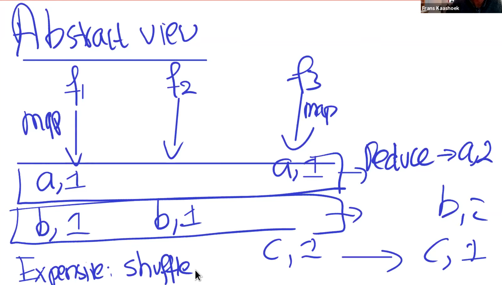
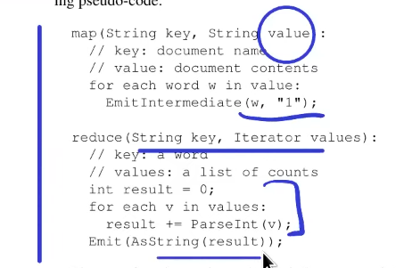

# Lecture 1 Introduction

## Why distributed systems?

- parallelism
- fault tolerance
- physical distribution
- security/isolated 

## Challenges

- concurrency 
- partial failure
- tricky to realize possible performance

## Focus: Infrastracture

- Storage
- Computation
- Communication RPC also 6.829

## Topics 

- Fault Tolerance 
  - availability
    - replication
  - recoverability
    - logging/transactions 
      - writing info to durable storage out of memory
- Consistency
  - strong vs weak consistency
- Performance
  - fights against consistency and fault tolerance to increase performance
  - throughput 
  - latency
    - tail latency: where 1 request takes a long time
- Implementation

## Map Reduce

- Context: Google computations
  - Multi hour computation of web indexing of terabytes of data
- Goal: make it easy for non experts
- Approach: 
  - Map: 
    - split input into chunks
    - apply function to each chunk
    - output key value pairs
  - Reduce: 
    - group by key
    - apply function to each group
    - output key value pairs
  - Abstact View
  - 
  - 
  
### Fault Tolerance

- cordinater reruns map/reduce 
- Both map and reduce can run twice 
- Atomic rename is done to create a unique write for every input
- Cordinator fail
  - have to rerun all map/reduce 
- Slow workers? 
  - strugglers, back up task on multiple machines 
